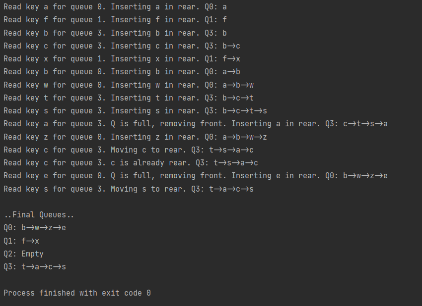

#
- In this assignment, you will implement **_N_ dynamic priority queues**. Let us first look at a single queue. Your program is given a sequence of objects, for example: a, b, w, a, x, s, … The queue maintains _numElements_ such objects, so that the first (front) is the oldest in the sequence, and the last (rear) is the most recent in the sequence. When the queue is full, the oldest (front) is deleted, so that the new object can be inserted (in rear). If an object that is already in the queue is seen again, it becomes the most recent (= it is moved to the rear). This way, the queue is maintained ordered by the key’s place in the sequence (rear = most recently referenced, front = least recently referenced).

- The **queue** will be implemented using a queue based on a **single-linked list** (_DynamicNode_, rear and front pointers, so it should be similar to _DynamicQueue_ on Canvas Files). Elements are inserted at the rear, deletion is explained in the following paragraphs. To implement a SINGLE queue, you CANNOT use: array, or any available library or STL classes_._

- We must use N queues, and rather than using N hard-coded variables, you should keep the _N_ **queues** in a 1-D **array**. So, if you want to use the 1-st queue, you would use Queues[0] in the main code; if you want to use the i-th queue, you would use Queues[i] in your main code. If instead of an array, your code has hardcoded the queues with N queue variables => about 10% off.

- Your program must set (_hardcode_) these: the number of queues (_N_=length of the array), and the max number of elements in each queue (_QUEUESIZE_).

-  Your program reads a file that contains a sequence of <key, index>
When a <_key_ _index_> pair is read, the program must insert the _key_ to the corresponding queue, queues[index]. In the example above, reading the first line <a 1> will insert ‘a’ into queues[1].
For example, to insert key ‘a’ into a specific queue, queues[i]:

	1. Check if the key (‘a’) already exists in the queue.
	2. If ‘a’ does NOT exist in the queue:
		- If the queue is NOT full insert new node with key ‘a’ in rear of queue.
		- Else //queue is full -- that is, it contains _QUEUESIZE_ elements remove front element of the queue; then, insert new node with key ‘a’ in rear.
	3. Else  // ‘a’ already exists in the queue
		-  Move the node with ‘a’ to the rear (so rear is again the most recently referenced key).

Example output using data.txt file, using number of queues N = 4 and queue size QUEUESIZE = 4

